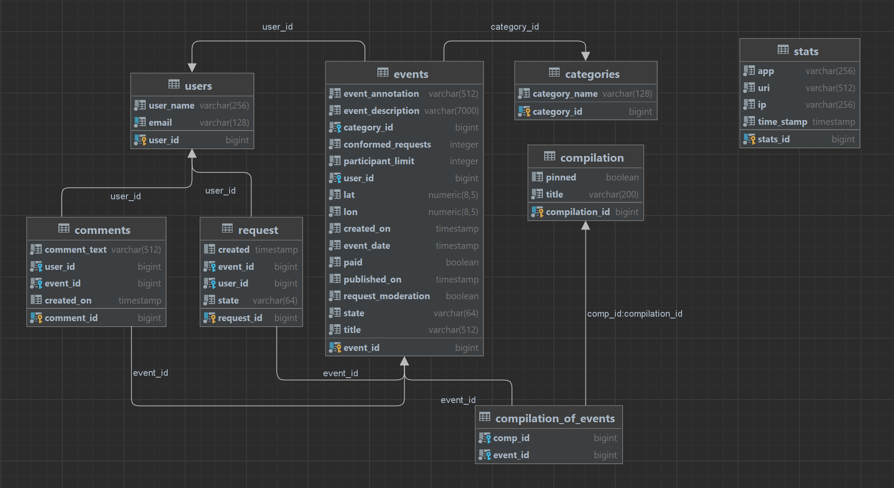

# Сервис для обмена информацией о событиях

**Программа позволяет делиться информацией о событиях (концерты/выставки/походы), получать информацию о событиях: подборки, поиск, оставлять комментарии.**

**Используемые стек: Java 17, Spring Boot, Spring JPA, Maven, PostgreSQL, Docker**

**Программа имеет два сервера: ewm-sercice и stats-server.**

Сервис ewm-sercice включает в себя основную логику приложения. 
Сервис stats-server хранит количество просмотров и позволяет делать различные выборки для анализа работы приложения.
Взаимодействие сервисов реализовано с помощью Сostume Client - наследуемый от BaseClient.
Запросы в БД производятся с использованием Spring JPA.

**Необходимо запускать docker-compose.yml на следующих портах:**
- ewm-sercice:    ports - 8080:8080
- ewm-db:         ports - 6541:5432
- stats-service:  ports - 9090:9090
- stats-db:       ports - 6542:5432

Данные хранятся в БД. Схема БД представлена ниже.

>

Примеры Endpoint запросов (программа написана на Java):

```java

    @GetMapping
    public List<EventFullDto> searchEvents(
            @RequestParam(name = "users", required = false) List<Long> usersId,
            @RequestParam(name = "states", required = false) List<EventState> eventStates,
            @RequestParam(name = "categories", required = false) List<Long> categories,
            @RequestParam(name = "rangeStart", required = false)
            @DateTimeFormat(pattern = "yyyy-MM-dd HH:mm:ss") LocalDateTime rangeStart,
            @RequestParam(name = "rangeEnd", required = false)
            @DateTimeFormat(pattern = "yyyy-MM-dd HH:mm:ss") LocalDateTime rangeEnd,
            @RequestParam(name = "from", defaultValue = "0") int from,
            @RequestParam(name = "size", defaultValue = "10") int size) {
        log.info("URL: /admin/events. GetMapping/Поиск события по параметрам/searchEvents");
        return eventService.searchEvents(
                usersId,
                eventStates,
                categories,
                rangeStart,
                rangeEnd,
                from,
                size);
    }
```
